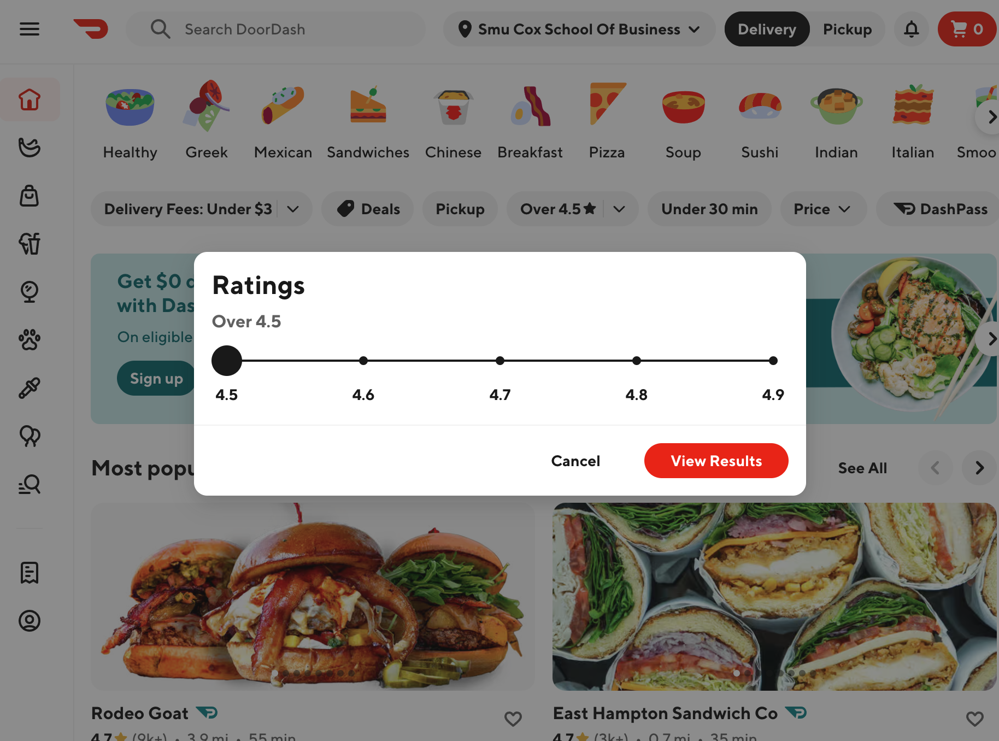
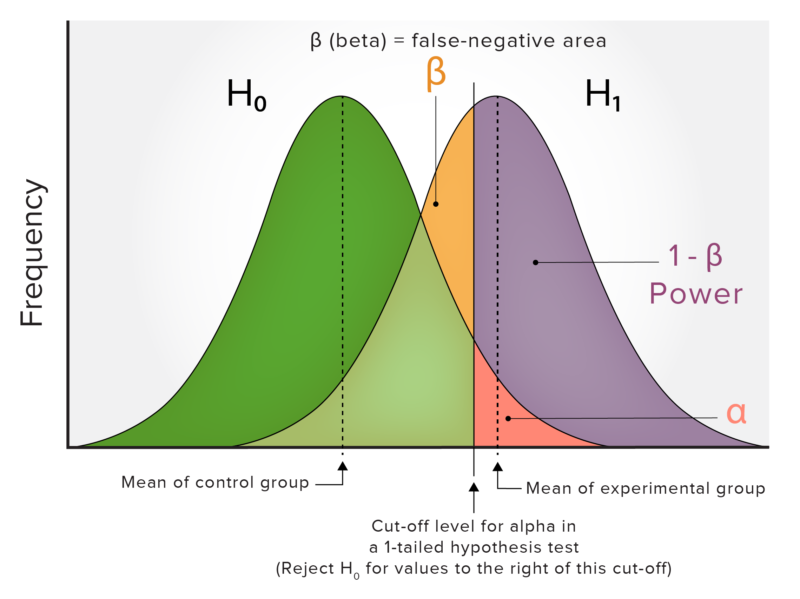
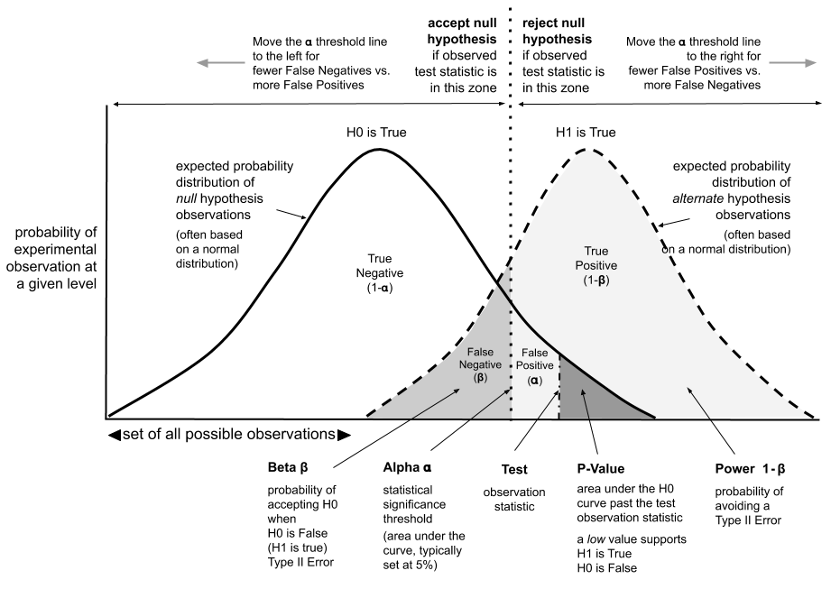

## This course

- Basics of causal inference
- Customer segmentation
- Feature selection
- Recommendation engines

## This week

- Experiments
- A/B testing
- Causal forests
- Power tests

```{r setup, include=FALSE}
knitr::opts_chunk$set(echo = TRUE, fig.align = "center", out.width = "80%")
library(tidyverse)
library(broom)
library(pwr)
library(binom)
library(kableExtra)

set.seed(123) # For reproducibility
```

# Experiments

## What is an experiment?

- Take sample from a population of subjects
- Randomly assign subjects to either treatment or control
- Measure average outcome for each subjects
- Compare outcomes between treatment and control groups

This procedure allows you to estimate the causal effect of the **treatment** on some **outcome**

## Why experiments?

- Causation vs. correlation: experiments help establish cause-and-effect relationships
- Reduce risk: test changes on a small scale before rolling them out to everyone
- Optimize ROI: identify what works best and allocate resources effectively

Example: testing different ad creatives to see which generates the most clicks

## Randomized Control Trials (RCTs): The Gold Standard

Randomization: participants are randomly assigned to one of the treatment groups or a control group

- Control Group: receives the existing treatment or no treatment
- Treatment Group: receives the new treatment or intervention
- Minimizes bias (incorrect estimate) and allows for *causal* inference

## Potential Outcomes in Causal Inference

Each subject has two potential outcomes in the experiment

- $Y_i(1)$: outcome from being treated
- $Y_i(0)$: outcome from not being treated

The individual treatment effect is the difference between these two outcomes:
$$\tau_i = Y_i(1) - Y_i(0)$$

Unfortunately, we can only observe one potential outcome for each subject, so we can never know what $\tau_i$ is for each subject 

## Average Treatment Effects

Since we can't observe these individual effects, we start with the **Average Treatment Effect** (ATE)

$$\tau = \mathbb{E}_i[Y_i(1) - Y_i(0)]$$

which we estimate as the difference-in-means

$$\widehat\tau = \frac{1}{n_1}\sum Y_i(1) - \frac{1}{n_0}\sum Y_i(0)$$

where $n_1$ and $n_0$ are the number of treated and control subjects. 

## Simple Example: DoorDash Ratings Scale

DoorDash changes the ratings minimum from 4.5 to 4

```{r echo=FALSE, out.width="70%", fig.align="center"}

```

```{r echo=FALSE}
set.seed(1)
n = 1000
treatment = round(runif(n))
mobile = round(runif(n))
age = round(runif(n,18,65))
mthsActive = runif(n,0,24)
seconds = 45 + 8*treatment + 12*mobile + 6*mobile*treatment + 2*age - 3*mthsActive + rnorm(n)
logodds = -1 + .5*treatment + -.5*mobile + -.6*mobile*treatment + .1*age - .6*mthsActive
purchase = rbinom(n,1,1/(1+exp(-logodds)))
ip = 1:n + 10000
doordash = data.frame(ip,age,mthsActive,treatment,mobile,seconds,purchase)
save(doordash,file='data/doordash.rdata')
```

## Why might DoorDash test this?

A lower minimum range expands the range of options

But, this increases search costs and can lead to abandoned carts since "worse" restaurants are included in the results list

Use a RCT to see what happens...

## Setup

**Control**: current design (4.5+)

**Treatment**: new, lower range (4+)

**Outcome**: time on site (in seconds)

Other potential outcomes: purchase, amount spent, rate of cart abandonment, etc.

- The outcome selected depends on who cares about these results and what the goal of the analysis is

## Doordash Data

```{r}
load('data/doordash.rdata')
str(doordash)
```

## ATE

```{r}
ate = doordash %>%
  group_by(treatment) %>%
  summarise(seconds_bar = mean(seconds))
ate
```

```{r echo=FALSE}
ate_num = round(ate %>% filter(treatment == 1) %>% pull(seconds_bar) - ate %>% filter(treatment == 0) %>% pull(seconds_bar),1)
```

So the ATE is about `r sprintf("%.1f",ate_num)` seconds.

## Another way...

```{r}
with(doordash,
     mean(seconds[treatment == 1]) - 
     mean(seconds[treatment == 0]))

```

Is this significantly different from zero?

## Use a t-test

Testing the difference in means (i.e., average seconds on the site) between the **treated** and **control** groups

```{r}
t.test(seconds ~ treatment,doordash)
```
## Or use regression...

Slightly different 95% CI on treatment, but this is splitting hairs...

```{r}
r1 = lm(seconds ~ treatment,doordash)
tidy(r1) %>% select(1,2,5) %>% 
  mutate(across(-1, ~round(., 3)))
confint(r1)
```

## Why use experiments?

The difference-in-means $\widehat\tau$ is an **unbiased** estimate of the average treatment effect (ATE)

- If we only gave mobile users the treatment and desktop users the control, our estimate may be biased because it captures both the treatment effect *and* the effect of the device type

In other words, randomization eliminates the possibility of **confounders**

## SUTVA

An assumption is that the outcomes for one subject do not affect the outcomes for other subjects

This is called the **Stable Unit Treatment Value Assumption** (SUTVA)

- Usually a problem when subjects might share their experiences with others (e.g., if other subjects become aware that a test is occurring)

## Aside: random sampling

The average treatment effect averages over the **population in the experiment**.

The ideal experiment randomly samples from the target population.

- Trivial in engineering experiments (e.g., Amazon, DoorDash, etc.)
- Do-able in marketing experiments
- Unethical in clinical trials 

So, there are two types of randomization in the ideal experiment: **random sampling** to select subjects and **random assignment** to treatments

In later classes we talk about about how to deal with violations of these.


## Wait, what if the treatment effect depends on...

- City vs rural individuals?
- Mobile vs desktop users?
- DashPass member status?
- Age?
- Tenure with DoorDash?
- Anything else...

## Enter HTE and CATE

When treatment effects vary by subgroup (even at the individual level) we have **heterogeneous treatment effects** (HTEs)

We allow for HTEs by estimating **conditional average treatment effects** (CATEs):

$$\mathbb{E}[\tau_i | X] = \mathbb{E}[Y_i(1)-Y_i(0) | X_i]$$

"The estimated treatment effect *conditional on* some value $X_i$"

## DoorDash CATE

Does the treatment effect *depend on* whether this was a mobile (vs desktop) user?

```{r}
r2=lm(seconds ~ treatment*mobile,doordash)
tidy(r2) %>% select(1,2,5) %>% 
  mutate(across(-1, ~round(., 3)))
```

## Confidence intervals

```{r}
confint(r2)
```
## DoorDash CATE

But make sure to control for potentially confounding variables for more precise estimates...

```{r}
r3=lm(seconds ~ treatment*mobile + age + mthsActive,
      doordash)
coef(r3)
```

## More precise CIs

```{r}
confint(r3)
```

## Use Causal Forests for more flexible mappings...

Rather than use linear regression to define subgroups, use random forests to accommodate HTEs

Instead of predicting outcomes, predict treatment effects

- *Random* forests split data to minimize prediction errors
- *Causal* forests split data to maximize the differences in estimated treatment effects between subgroups

## "Honest" tree construction

In a causal forest, data is usually split into separate subsets:

1) One for building the tree structure 

2) Another for estimating treatment effects within the resulting nodes

Also known as "split-sample" or "double-sample" estimation

## Driven by CART

A **classification and regression tree (CART)** is the building block for causal forests

These partition the data into subsets based on feature values

```{r echo=FALSE, out.width="70%", fig.align="center"}
knitr::include_graphics("w1cart.png")
```


## Classification tree for categorical outcomes

**Example** 

- Predicting churn (yes/no)

**Splitting criteria**

- Gini Impurity: probability of incorrectly classifying a randomly chosen element
- Entropy: disorder or randomness in a set of data
- Minimize impurity in the child nodes
- Intuition: a group of {A,A,A} has less impurity in the final node versus {A,B,C}, so create branches and nodes accordingly

**Prediction**

- Most common value within a node

## Regression tree for continuous outcomes

**Example**

- Predicting house prices

**Splitting criteria**

- Minimize the sum of squared residuals (differences between predicted and actual values) within the child nodes
- In other words, create groups of similar values

**Prediction**

- Average value of outcomes within a node

## Simple regression tree in DoorDash

We can fit a random forest using the `grf` package

`grf` stands for "Generalized Random Forests"

```{r}
library(grf)
X = doordash %>% select(mobile,age,mthsActive)
Y = doordash$seconds

rf   = regression_forest(X, Y, num.trees = 1)
tree = get_tree(rf, 1)
#plot(tree)
```

## Random forests

A **random forest** is a collection of trees estimated from different sub-samples of the data

The predictions for each unit are averaging the predictions across trees

This is an example of **bagging** which is an **ensemble technique**

Simply increase `num.trees` from the prior slide to turn the single "tree" into a "forest"

```{r, eval = TRUE}
rf50 = regression_forest(X, Y, num.trees = 50)
#plot(get_tree(rf50, 1))
#plot(get_tree(rf50, 50))
```

## Random forest predictions

Random forests aggregate across trees to get the prediction

Unlike linear regression, predictions don't *necessarily* follow a linear pattern

```{r}
plot(X$age, rf50$predictions, col=factor(X$mobile))
```

## Now for *causal* forests

A **causal forest** is a random forest built to predict each unit's *treatment effect* $\tau_i = Y_i(1) - Y_i(0)$ as a function of potential variables $X_i$

It allows us to sort through the potential variables quickly and identify non-linear relationships

## Causal forest for DoorDash

To fit a causal forest, we call `grf::causal_forest`

The inputs are the variables `X`, the outcomes `Y`, the treatment `W`, and the probability of treatment in the experiment `W.hat`

```{r}
W     = doordash$treatment
W.hat = .5 #randomly assigned, equally sized groups
cf = causal_forest(X, Y, W, W.hat=0.5, seed=1) 
```

## Causal forest CATEs

The goal of the causal forest is to estimate the conditional average treatment effects (CATEs):

$$\mathbb{E}[\tau_i|X_i] = \mathbb{E}[Y_i(1)-Y_i(0)|X_i]$$
```{r}
doordash$CATE = cf$predictions
str(doordash)
```

## Heterogeneity in predicted CATES

```{r}
hist(cf$predictions)
```

## Causal forest versus random forest

The random forest predicts *seconds* but the causal forest predicts *CATE*s

```{r}
plot(rf$predictions, cf$predictions)
```

## Causal forest CATES by desktop/mobile

```{r}
boxplot(CATE~mobile,doordash)
#or stripchart(CATE~mobile,doordash,vertical=TRUE)
```

## Causal forest CATEs versus age
```{r ,echo=FALSE}
ggplot(doordash,aes(mthsActive,CATE,color=factor(mobile))) + 
  theme_minimal(15) +
  theme(legend.position = 'bottom') + 
  xlab('Months with DoorDash') + 
  scale_color_discrete(name='Desktop (0) or Mobile (1)') +
  geom_point()
```
## Optimal treatement given $X$?

```{r}
library(policytree)
#opportunity cost of not treating = -tau
rewards = cbind(control=-get_scores(cf), 
                treatment=get_scores(cf))
tree = policy_tree(X, rewards, min.node.size = 1)
plot(tree, leaf.labels=c("Control", "Treatment"))
#see R for this plot
```

## Which predictors are the most important? 

It can be hard to figure out which modifiers are "important"

One way to do that is to use `grf:best_linear_projection` which finds the linear model that fits best to the random forest. 

```{r}
best_linear_projection(cf, X)
```

## Causal forest average treatment effect

`grf::average_treatment_effect` combines the CATES to obtain an average treatment effect

It is similar to our difference-in-means estimate

```{r}
average_treatment_effect(cf)
```

Sometimes `std.err` of the causal forest ATE will be smaller than the difference-in-means ATE.

Accounting for variability due to differences in $X_i$ can make the ATE estimate more precise.


# Power Calculations

## Hypothesis testing review

Alpha $\alpha$

- Significance level (usually .05)
- Probability of making a Type I error
- A Type I error is a "false positive"
- False positive: an incorrect "yes", or we think there *is* an effect when there *is not*
- Specifically: *rejecting* the null when the null is actually *true*

Beta $\beta$

- Probability of a Type II error
- A Type II error is a "false negative"
- False negative: an incorrect "no", or we think there *is no* effect when there *is*
- Specifically: *failing* to reject the null when the null is actually *false*

*Note*: $\alpha \ne (1-\beta)$, but they are inversely related: increasing $\alpha$ decreases $\beta$

## One picture...

```{r echo=FALSE, out.width="90%", fig.align="center"}

```

## Another option...

```{r echo=FALSE, out.width="90%", fig.align="center"}

```

## The Importance of Power

**Power** is $1 - \beta$: the probability of finding a effect when a true effect exists

In other words, reject the null hypothesis when it is in fact false

Typically set to .8

How to increase power:

- Increase the sample size
- Reduce variance (noise in the data) by controlling for confounding variables and make units as similar as possible
- Increase alpha (say .05 to .10), but this increases the probability of a Type I error (false positive)

## Power Calculations in R

See `library(pwr)`

```{r}
pwr.t.test(d = 0.2,      #difference in means
    sig.level = 0.05,    #Type I error (alpha)
    power = 0.8,         #Power (1 - pr(Type II))
    type = "two.sample", #one/two/paired
    alternative = "two.sided")
```

## Interpreting power calculations

The output shows the required sample size per group to achieve the desired power

A larger effect size requires a smaller sample size, and vice-versa

Next week we look at how to reduce variance to increase the power

## Smaller Effect $\rightarrow$ Larger N

```{r}
pwr.t.test(d = 0.01,     #difference in means
    sig.level = 0.05,    #Type I error (alpha)
    power = 0.8,         #Power (1 - pr(Type II))
    type = "two.sample", #one/two/paired
    alternative = "two.sided")
```

# Case Study: Amazon Website Optimization

## Goal

Increase conversion rate

- Percentage of visitors who make a purchase

**Hypothesis**: a redesigned product page with larger images and customer testimonials will lead to higher conversions

## Experimental Design

RCT: randomly assign website visitors to either the existing product page (control) or the redesigned page (treatment)

Metric: conversion rate (% of customers who end up purchasing)

Test duration: 2 weeks

## Data

```{r, echo = FALSE}
set.seed(1)
n = 5000
mobile       = sample(c(0,1),n,replace = TRUE)
prime        = sample(c(0,1),n,replace = TRUE)
monthlySpend = round(rlnorm(n,3),2)
treatment    = sample(c(0,1),n,replace = TRUE)

conversion_prob = .07 -.01*mobile + .001*monthlySpend + .02*prime + .08*treatment - .12*treatment*prime
conversion_prob = pmin(pmax(conversion_prob,0),1) #bound to 0/1
conversion = rbinom(n, 1, conversion_prob)

amazon = data.frame(conversion,treatment,mobile,prime,monthlySpend)
save(amazon,file='data/amazon.rdata')
```

```{r}
load('data/amazon.rdata')
head(amazon)

```

## ATE for proportions

```{r}
ate_p = amazon %>%
  group_by(treatment) %>%
  summarise(conversion_bar = mean(conversion))
ate_p
```

```{r echo=FALSE}
ate_num_p = round(ate_p %>% filter(treatment == 1) %>% pull(conversion_bar) - ate_p %>% filter(treatment == 0) %>% pull(conversion_bar),3) * 100
```

So the ATE is about `r sprintf("%.1f",ate_num_p)`%.

## Another way...

```{r}
with(amazon,
     mean(conversion[treatment == 1]) - 
     mean(conversion[treatment == 0]))

```

Is it significant?

## Confidence Intervals for Proportions

```{r}
n = nrow(amazon)
binom.confint(sum(subset(amazon,treatment == 1)$conversion),
              n = sum(amazon$treatment),method='prop.test')
binom.confint(sum(subset(amazon,treatment == 0)$conversion),
              n = sum(amazon$treatment == 0),method='prop.test')

```

## Use a prop-test

Testing the difference in proportions (i.e., purchase rate) between the treated and control groups

```{r}
propData = amazon %>% group_by(treatment) %>%
  summarise(conversions = sum(conversion),n = n())
prop.test(propData$conversions,propData$n)
```

## Controlling for confounders

```{r}
cate_p = glm(conversion ~ treatment*prime + 
  monthlySpend + mobile,amazon,family='binomial')
#coef(cate_p)
tidy(cate_p) %>% select(1,2,5) %>% 
  mutate(across(-1, ~round(., 3)))
```

## Confidence intervals

But these are on log-odds effects...

```{r}
confint(cate_p)
```

## Predict probabilities

Remember, treatment effect depends on $X$ since this is non-linear

Setup various conditions and compare predicted conversion probabilities

```{r}
cate_p_df = expand.grid(
  treatment = 0:1,
  mobile = 0:1,
  monthlySpend = round(mean(amazon$monthlySpend),2),
  prime = 0:1)
lo_hat = predict(cate_p, newdata = cate_p_df, 
                 se.fit = TRUE)
lower_lo = lo_hat$fit - 1.96 * lo_hat$se.fit
upper_lo = lo_hat$fit + 1.96 * lo_hat$se.fit
```

## Compare results

Looks like Prime users have a null/negative treatment effect

```{r}
cbind(cate_p_df,lb = round(plogis(lower_lo),3),
                ub = round(plogis(upper_lo),3))
```

## *Bootstrap SEs on the probabilities

Another option is to bootstrap the predicted probabilities

Probably more useful in more complex models, but might be useful to see here

Steps:

1) Sample with replacement from the data
2) Estimate the model and save predicted probabilities
3) Repeat many times

## *In R 

Using a simplified model, but the idea generalizes

```{r}
nBootstraps = 100
n = nrow(amazon)
bootstrapOut = data.frame(control = rep(NA,nBootstraps),
                          treatment = rep(NA,nBootstraps))

for(b in 1:nBootstraps){
  df_b = amazon[sample(1:n,n,replace=TRUE),]
  temp = glm(conversion ~ treatment,family='binomial',data = df_b)
  bootstrapOut[b,] = predict(temp,data.frame(treatment = 0:1),type='response')
}
```

## *Now take quantiles

```{r}
#head(bootstrapOut)
apply(bootstrapOut,2,quantile)
```

## *Or get quantiles this way...

```{r}
bootstrapOut %>%
  reframe(across(c(control,treatment),
                   ~quantile(.x,c(.025,.975))))
```

## *Another option for bootstrapping...

Slight modification
```{r}
singleBootstrap = function() {
  df_b = amazon[sample(1:n,n,replace=TRUE),]
  temp = glm(conversion ~ treatment,family='binomial',data = df_b)
  predict(temp,data.frame(treatment = 0:1),type='response')
}

#control | treated
bootOut = t(replicate(10,singleBootstrap()))
apply(bootOut,2,quantile)
```
## Causal forest 

```{r}
W = amazon$treatment
Y = amazon$conversion
X = amazon %>% select(-c(treatment,conversion))
cf_amzn = causal_forest(X, Y, W, W.hat = 0.5, seed=1) 
amazon$CATE = cf_amzn$predictions
```

## Causal forest ATE

```{r}
average_treatment_effect(cf_amzn)
```

## Heterogeneity in predicted CATES

```{r}
hist(cf_amzn$predictions)
```

## Which predictors are the most important? 

```{r}
best_linear_projection(cf_amzn, X)
```

## Causal forest CATES versus mobile users

```{r}
boxplot(CATE~prime,amazon)
```

## Causal forest CATEs versus Prime
```{r echo=FALSE}
ggplot(amazon,aes(monthlySpend,CATE,color=factor(prime))) + 
  theme_minimal(15) +
  theme(legend.position = 'bottom') + 
  geom_point() +
  scale_x_continuous(trans = 'log')
```
## Which treatement given $X$?

```{r}
rewards = cbind(control=-get_scores(cf_amzn), 
                treatment=get_scores(cf_amzn))
tree = policy_tree(X, rewards, min.node.size = 1)
plot(tree, leaf.labels=c("Control", "Treatment"))
```

## Interpretation

- On average, the redesigned page increased conversions by about 2.8%

- But, the treatment effect was significantly lower for Prime users (why? Maybe they were so used to the old layout)

- We also see heterogeneity in monthly spend levels: the Prime differential is greater for those with lower monthly spend

## What to do?

What are the limitations of releasing this?

Is the negative Prime effect a concern?

Is the difference worth it?

- Think about proportion of Prime users to everyone else, if it is small then it doesn't matter if there is a negative effect in this group

Any other ideas?

# Bonus Tips

## On Writing I of II

- **For your analysis to have impact, it needs to be understood**

- Write like you speak: plainly with small words, simple sentences, and short paragraphs

- Read your writing out loud. Good writing sounds natural.

- Be specific: "increases substantially" $\rightarrow$ "increases by 5%"

- Focus on actionable insights

## Writing Tips II

Use active voice rather than passive voice: 

{subject} + {verb} + {object}

**Active**

- Our campaign generated 15% more leads
- We collected survey responses from 5,000 subjects
- We recommend implementing an A/B test on the home page

**Passive**

- 15% more leads were generated from our campaign
- Survey responses were collected from 5,000 subjects
- It is recommended that A/B testing is implemented on the home page

## Next Week

- Variance reduction with CUPED

- PSM 

- AIPW

- DoubleML