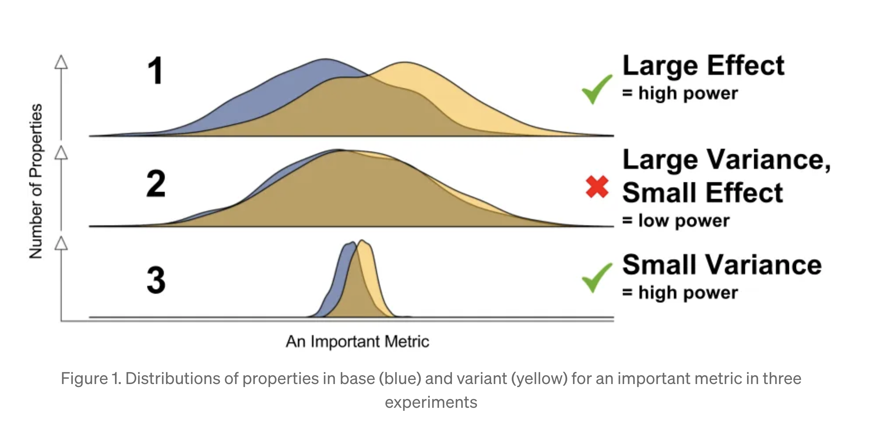

## This week

- A/B variance reduction
- Propensity Score Matching (PSM)
- Augmented Inverse Probability Weighting (AIPW)
- DoubleML (Double/Debiased ML)

```{r setup, include=FALSE}
knitr::opts_chunk$set(echo = TRUE, fig.align = "center", out.width = "80%")
library(tidyverse)
library(kableExtra)
library(broom)
showlm = function(obj) tidy(obj) %>% select(1,2,3,5) %>% mutate(across(-1, ~round(., 3)))
```

## Variance reduction

```{r echo=FALSE}
#https://bytepawn.com/five-ways-to-reduce-variance-in-ab-testing.html
#https://www.microsoft.com/en-us/research/articles/deep-dive-into-variance-reduction/
```

To prevent false negatives ("missed detection"), we try to minimize uncertainty in our estimate of the treatment effect

This is reflected in the standard error of the treatment effect

Random assignment ensures that the difference between treatment and control groups is *unbiased* (i.e., on average, the difference is accurate)

- But this does not consider the *uncertainty* in the estimate

## Variance is a function of sample size

$$
Var(\hat{\tau}) = \frac{\sigma^2_1}{n_1} + \frac{\sigma^2_2}{n_2}
$$
For groups 1 and 2 (e.g., "treatment" and "control")


$$
CI(\hat{\tau}) = \hat{\tau} \pm z_{\alpha/2}\sqrt{Var(\hat{\tau})}
$$

## See it in R...

```{r}
var_t = 5 #variance outcomes
var_c = 2
n_t = 100 #number of observations
n_c = 100
tau = 13  #treatment estimate
a = .05   #significance level
z = abs(qnorm(a/2)) #1.96

var_tau = var_t/n_t + var_c/n_c
var_tau; tau - z*sqrt(var_tau); tau + z*sqrt(var_tau)
```

## Double $n$

```{r}
n_t = 100*2
n_c = 100*2

var_tau = var_t/n_t + var_c/n_c
var_tau; tau - z*sqrt(var_tau); tau + z*sqrt(var_tau)
```

## Or half the variance in $Y$

```{r}
var_t = 5/2 #halved
var_c = 2/2
n_t = 100   #reset
n_c = 100

var_tau = var_t/n_t + var_c/n_c
var_tau; tau - z*sqrt(var_tau); tau + z*sqrt(var_tau)
```

## Given a fixed $n$, better to have an even split

```{r}
getTau  = function(p = .5,n = 1000) {
  var_t/(p*n) + var_c/((1-p)*n)}
pLevels = seq(0.01,.99,.01)
splitN = data.frame(pLevels,var = getTau(pLevels))
```
```{r echo=FALSE}
ggplot(splitN,aes(pLevels,var)) + 
  geom_line() + 
  theme_minimal()
```

## General rule of thumb

```{r echo=FALSE}
#https://sites.stat.washington.edu/NRCSE/research/struts/chapter2.pdf
```

$$
n \approx \frac{16\sigma^2}{(\mu_1 - \mu_2)^2} = \frac{16}{\Delta^2}
$$

where $\Delta = \frac{\mu_1 - \mu_2}{\sigma}$ or the *standardized effect size* or **Cohen's d**

In other words, treatment effect in terms of *standard deviations of difference*

## Simple example

Average monthly spend is \$40 pre-treatment with a SD of \$18

We want to run an experiment, with the goal of increasing average monthly spend to $46

How many observations are needed for enough power?

```{r echo=FALSE, eval=FALSE}
16*18^2/(46-40)^2
```

$$
\frac{16\times18^2}{(46-40)^2} = 144 
$$

## In R

```{r}
library(pwr)
pwr.t.test(d = (46-40)/18,
           sig.level = .05,
           power = .8)
```

## More realistic

Changing conversion rate from 2% to 2.02% requires 3.8M users...

```{r}
h = ES.h(.02,.0202) ##Cohen's d for proportions 
pwr.p.test(h = h,
    sig.level = 0.05,    
    power = 0.8,         
    alternative = "two.sided")
```

## Stratified Sampling

```{r echo=FALSE, eval=FALSE}
#https://en.wikipedia.org/wiki/Stratified_sampling
#https://bytepawn.com/five-ways-to-reduce-variance-in-ab-testing.html
```

Stratified sampling lowers variance by sampling each sub-population according to its distribution at the population level

For example: if 90% of your users are *mobile* and 10% are *desktop* then random sampling should be *close* to this, but why not make it *exact*?

## Toy example

```{r}
pop     = 10000
mobile  = rep(1:0,c(pop*.9,pop*.1))
d = sample(0:1,pop,TRUE)
treatment_effect = 3
sales =  10 + treatment_effect*d + 12*mobile + 
          rnorm(pop,0,4)
pop_df = data.frame(sales,d,mobile)
#regular sample
n = 300
set.seed(1);reg_df = pop_df %>% sample_n(n)
prop.table(table(reg_df$mobile))
```

## Stratified Sample

```{r}
n_mobile  = n*.9
n_desktop = n*.1

ss_df = bind_rows(
  pop_df %>% filter(mobile == 1) %>%
  sample_n(n_mobile),
  pop_df %>% filter(mobile == 0) %>%
  sample_n(n_desktop))

prop.table(table(ss_df$mobile))
```

## Compare ATE variance...

```{r}
showlm(lm(sales ~ d,reg_df))
showlm(lm(sales ~ d,ss_df))
```

## CUPED

**Controlled-experiment Using Pre-Existing Data**: variance reduction technique to increase the sensitivity of experiments

In short: reduce the "noise" in the data in order to detect the true impact of changes

*Why?* Minor product changes tend to produce small effects, but companies still want to be able to detect these changes because they scale across millions of users

## Some history

Introduced by researchers at [Microsoft](https://dl.acm.org/doi/abs/10.1145/2433396.2433413) in 2013

Widely used by many large companies such as:

- [Netflix](https://www.kdd.org/kdd2016/papers/files/adp0945-xieA.pdf)
- [Booking](https://booking.ai/how-booking-com-increases-the-power-of-online-experiments-with-cuped-995d186fff1d)
- [Meta](https://research.facebook.com/blog/2020/10/increasing-the-sensitivity-of-a-b-tests-by-utilizing-the-variance-estimates-of-experimental-units/)
- [Airbnb](https://arxiv.org/abs/2112.13299)
- [DoorDash](https://careersatdoordash.com/blog/improving-experiment-capacity-by-4x/)

and many others...

## Intuition

From Booking link on previous slide

```{r echo=FALSE, out.width="90%", fig.align="center"}

```

```{r echo=FALSE}
#https://matteocourthoud.github.io/post/cuped/
#https://bytepawn.com/reducing-variance-in-ab-testing-with-cuped.html
#https://www.statsig.com/blog/cuped
#https://medium.com/data-science/how-to-double-a-b-testing-speed-with-cuped-f80460825a90
```

## Problems with low power

With low power, statistical tests tend to fail even if the change (however small) has a meaningful effect

An experiment is underpowered when the treatment effect is too small relative to the metric's variance for a given sample size

By reducing the variance in the estimator (e.g., the ATE) allows us to:

- Detect smaller effects

- Detect the same effect but with a smaller sample size

## Enter CUPED

**Intuition:** variance in pre-experiment data is unrelated to the treatment effect and can be removed

Example from Booking.com

- The number of bookings per property per day can range from zero to thousands, so it has large variance

- But we know the average bookings per day for each property involved in the experiment

- We can use this to see change in bookings at the property-day level

CUPED uses pre-experiment data to remove variance in a straightforward and scalable way

## Details

$Y_1$ is the outcome of interest

$D$ indicates if the observation is in the treatment (1) or control (0) group

$X$ is pre-treatment variable used to reduce the variance

Good properties of $X$

- Not affected by the treatment assignment (e.g., recieving a treatment is not a function of $X$)

- Highly correlated with $Y_1$

Typically people use pre-treatment $Y$ values: $Y_0$

## Estimation

1) Regress $Y_1$ onto $Y_0$ and get $\hat{\theta}$

2) Compute $Y_1^{cuped} = Y_1 - \hat{\theta}(Y_0 - \bar{Y}_0)$

3) Use $Y_1^{cuped}$ instead of $Y_1$

```{r, echo=FALSE}
n  = 5000
id = sample(100000:999999,n,replace = FALSE)
bookings_pre = rpois(n,12)
treated = sample(c(0:1),n,TRUE)
bookings = bookings_pre + 3*treated + rpois(n,2)
booking  = data.frame(bookings,bookings_pre,treated)
save(booking,file='data/booking.rdata')
```

## Booking.com Example

```{r}
load('data/booking.rdata')
str(booking)
```

## Booking ATE

```{r}
y1       = booking$bookings
treated  = booking$treated

showlm(lm(y1~treated))
```

## Booking CUPED

```{r}
y0 = booking$bookings_pre
lm_booking = lm(y1 ~ y0)
theta      = coef(lm_booking)[2]
y1_cuped   = y1 - theta*(y0 - mean(y0))
showlm(lm(y1_cuped ~ treated))
```


```{r echo=FALSE, eval=FALSE}
## Variance reduction
var(y1_cuped)/var(y1)
1-cor(y1,y0)^2
```

## Why not just add $y0$ like CATE?

```{r}
showlm(lm(y1 ~ treated + y0))
```

## Repeat 1,000 times on simulated data

```{r}
n = 1000
nSim = 1000
estD = data.frame(ate=rep(NA,nSim),cuped=NA,lm=NA)
te = 5
for(i in 1:nSim){
  y0 = rnorm(n,100,sd=20)
  d  = sample(c(0, 1),n,replace = TRUE)
  y1 = 10 + y0 + te*d + rnorm(n,0,20)
  theta = cov(y0,y1)/var(y0)
  y1_cuped = y1 - theta*(y0 - mean(y0))
  
  estD[i,'ate']   = coef(lm(y1 ~ d))[2]
  estD[i,'cuped'] = coef(lm(y1_cuped ~ d))[2]
  estD[i,'lm']    = coef(lm(y1 ~ d + y0))[2]
}
```

## Simlar means and variances...

```{r}
sapply(estD, function(x) c(mean = mean(x), 
                           variance = var(x)))
```

## CUPED is *very* similar to CATE

At least for ["simple average metrics"](https://arxiv.org/pdf/2312.02935)

```{r echo=FALSE, message=FALSE}
estD_long = estD %>% pivot_longer(everything())

ggplot(estD_long,aes(value,fill=name,color=name)) + 
  theme_minimal() +
  geom_vline(xintercept = te,linetype = 'dashed') + 
  geom_histogram(alpha = .2,position='identity')
```

# Non-Experimental Causal Inference

## Treatment assignment is not always random

In many cases, people are not offered treatments randomly

For example, randomization may have occurred at the zip code level, but not the individual level

Or there was no randomization and you only have observational data

- For example, marketing offers sent to customers who meet certain criteria

- On Google Ads, users exposed to the ad might also be more likely to make purchases due to other factors (e.g., search engine activity)

## Methods

Three popular approaches to dealing with this:

1) **Propensity Score Matching (PSM)**: match observations from the treatment and control groups based on covariates to increase comparability

2) **Augmented Inverse Probability Weighting (AIPW)**: provides a "doubly robust" estimate of the treatment effect using both propensity scores and outcomes

3) **Double ML**: Improvement from AIPW by using ML for more flexible mappings to the propensity scores and outcomes

## Propensity Score Matching (PSM)

We observe treatment and control outcomes, but not necessarily from an RCT

For example, treatments may be selected by the individual rather than randomly assigned

PSM attempts to balance the groups on confounding factors

- Find observations that are very similar, but one received the treatment and the other the control (sort of like RDD)

## How does it work?

1) Calculate propensity scores via logistic regression: *Pr(treatment|X)*

2) Check the matched data (some observations may be removed)

3) Estimate treatment effects on the matched data

## Casino Example

You work for the Wynn in Las Vegas

You want to evaluate the effectiveness of an offer on return trip spend (i.e., play volume)

Those who received the offer might be different from those who did not

```{r, echo=FALSE}
n <- 5000

# Simulate covariates with more realistic distributions and dependencies
age <- round(rnorm(n, 55, 12))  # Mean age slightly higher
income <- exp(rnorm(n, 10.5, 0.8)) # Log-normal distribution for income
loyalty <- sample(c(0, 1), n, replace = TRUE, prob = c(0.6, 0.4))  # More realistic loyalty split

# Introduce some correlation between age and income
income <- income + 0.1 * (age - mean(age)) * 1000  # Add correlation

# Simulate the targeted mail offer (treatment)
# Customers with higher income, age, and in the LP are more likely to receive an offer
propensity_score <- plogis(-4 + 0.02 * age + 0.00001 * income + 2 * loyalty)
treatment <- rbinom(n, 1, propensity_score)

# Simulate outcome (spend during the next month)
# Spend is influenced by age, income, loyalty, and the treatment effect, with interaction
treatment_effect <- 150  # Average treatment effect

# Add an interaction term between treatment and loyalty
interaction_effect <- 75 * treatment * loyalty

spend <- 300 + 0.4 * age + 0.003 * income + 100 * loyalty + treatment_effect * treatment + interaction_effect + rnorm(n, 0, 300)

# Create data frame
casino <- data.frame(age, income, loyalty, treatment, spend)

save(casino,file='data/casino.rdata')

#https://dlab.berkeley.edu/news/introduction-propensity-score-matching-matchit
#https://cran.r-project.org/web/packages/MatchIt/vignettes/MatchIt.html
```

## Data

```{r}
load('data/casino.rdata')
str(casino)
```

## ATE

```{r}
showlm(lm(spend ~ treatment,casino))
```

## CATE

A lot of the ATE is simply because those in the LP play at a higher level (and more likely to receive an offer)

```{r}
showlm(lm(spend ~ treatment + 
            age + income + loyalty,casino))
```

## Match with PSM

```{r warning=FALSE}
library(MatchIt)
ps_match = matchit(treatment ~ 
              age + income + loyalty,casino)
```

*Note:* There is also exact matching, see the package for more information


## What happened?

Keeps all treated, and finds non-treated that look most similar

```{r}
ps_match
```

## Check matching...

```{r eval=FALSE}
summary(ps_match)
```

See "loyalty":

- In the *original* data, 74% of the treated subjects and 31% of the control subjects were in the LP

- In the *matched* data 76% of the control subjects are in the LP

Goal:

- Get the standardized mean difference and empirical CDFs close to 0

- Get the variance ratio close to 1

## Check propensity scores

Ideally, unmatched propensity scores are far away from the treated group (and would thus require greater extrapolation if kept)

```{r, eval=FALSE}
plot(ps_match, type = "jitter", interactive = FALSE)
```

## Check densities

```{r eval=FALSE}
plot(ps_match, type = "density", 
     interactive = FALSE,
     which.xs = ~income + loyalty)
```

## Get CATE

```{r}
casino_md = match.data(ps_match)
showlm(lm(spend ~ treatment + age + income + loyalty,
          casino_md))
```

## IPW and propensity scores

If you know the propensity scores $e(X_i)$, you can re-weight the observations to balance the covariates between the treatment and control groups

$$
\tau_{IPW} = \mathbb{E}\left[\frac{d_iY_i}{e(X_i)} - \frac{(1-d_i)Y_i}{1-e(X_i)}\right]
$$

## Casino ATE with IPW

```{r}
response_model = glm(treatment ~ age + income + loyalty,
                     casino,family='binomial')
casino$e = predict(response_model,type='response')
casino = casino %>% 
  mutate(ipw = treatment/e + (1-treatment)/(1-e))
```

## Used IPW as weights in `lm`

```{r}
showlm(lm(spend ~ treatment, weights = ipw,casino))
```

## Checking overlap assumption

When using propensity scores (without matching) make sure covariates are balanced

```{r echo=FALSE}
ggplot(casino,aes(e,fill=factor(treatment))) + 
  theme_minimal() +
  geom_density(alpha = .5) + 
  xlab('Propensity Score') + 
  scale_fill_discrete(name = 'Treatment') +
  theme(legend.position = 'bottom')
```

## AIPW or Double-Robust Estimators

Essentially combines IPW with CATE

1) Estimate a response model to get *propensity scores* $e(X) = \mathbb{E}[d|X]$

2) Estimate an outcome model to get the *response function* $u^{(d)}(X) = \mathbb{E}[Y|d,X]$

This is called "doubly robust" because the final estimate is **unbiased** even if one of the two functions is misspecified 

```{r echo=FALSE, eval=FALSE}
#https://towardsdatascience.com/understanding-aipw-ed4097dab27a/
```

## The AIPW estimator

This looks way more complicated than it is:

$$
\hat{\tau} = \frac{1}{n}\sum_{i=1}^n\left(u^1(X_i) - u^0(X_i) + \frac{d}{e}(Y_i - u^1(X_i)) - \frac{1-d}{1-e}(Y_i - u^0(X_i)) \right)
$$

## In R

```{r}
outcome_model = lm(spend ~ treatment + 
                     age + income + loyalty,casino)
u1 = predict(outcome_model,casino %>% mutate(treatment = 1))
u0 = predict(outcome_model,casino %>% mutate(treatment = 0))
y = casino$spend
e = casino$e
d = casino$treatment
mean(u1 - u0 + d/e*(y - u1) - (1-d)/(1-e)*(y - u0))
```

## Or use `grf`

Notice how we now leave out the `W.hat` argument, this tells `grf` to estimate the propensity scores for you

```{r warning=FALSE}
library(grf)
X  = casino[,c('age','income','loyalty')]
cf = causal_forest(X,y,d)
average_treatment_effect(cf)
```

## DoubleML

Basically AIPW with ML at both steps (the response and outcome model)

Relies on "partialling out" the treatment effect

## Partialling out

If you want to isolate the treatment effect $d$ on $y$ in the presence of confounding variables $X$ you can partial out the treatment effect.

Regress the *residuals* from `y ~ X` against the *residuals* of `d ~ X`.

Both of these yield the same coefficient on $d$:

```{r eval=FALSE}
lm(y ~ d + X)
lm(lm(y ~ X)$residuals ~ lm(d ~ X)$residuals)

```

## Who cares?

DoubleML uses machine learning to predict both the treatment and the outcome, given the confounders

The residuals from these predictions represent the parts of the treatment and outcome that are independent of the confounders

This effectively "partials out" the influence of the confounders, removing the spurious correlation between the treatment and outcome, allowing for a more accurate estimate of the treatment effect

- Essentially, it removes the variation in the outcome that is explained by the confounders, so that the variation remaining is only due to the treatment

## DoubleML steps (don't worry, a package will do all this)

1) Split the sample into two

2) Estimate the the response and outcome models (typically using random forests) both sets

3) Using the estimated models, predict out-of-sample and save residuals

4) Run a linear regression of the outcome residuals on the response residuals

5) Average these two coefficients -- this is the DoubleML ATE

See .rmd file for `R` code

```{r eval=FALSE, echo=FALSE}
n = nrow(casino)
Y = casino$spend
D = casino$treatment
X = as.matrix(casino[,c('age','income','loyalty')])

lm(Y ~ D + X)
lm(lm(Y ~ X)$residuals ~ lm(D ~ X)$residuals)

#Now we can use ML for both steps to "residual out" the treatment effect
#To do this properly, we need a train/test split
ind = sample(1:n,n/2)
Y1 = Y[ind]
D1 = D[ind]
X1 = X[ind,]

Y2 = Y[-ind]
D2 = D[-ind]
X2 = X[-ind,]

#Estimate pr(D | X) and E[Y | X]:
library(randomForest)
e_Y1 = randomForest(X1,Y1)
e_Y2 = randomForest(X2,Y2)
e_D1 = randomForest(X1,D1)
e_D2 = randomForest(X2,D2)

#Out of sample predictions
Y1_hat = predict(e_Y2,X1) #E[Y1 | X1]
Y2_hat = predict(e_Y1,X2)
D1_hat = predict(e_D2,X1)
D2_hat = predict(e_D1,X2)

#Residuals
r_Y1 = Y1 - Y1_hat
r_Y2 = Y2 - Y2_hat
r_D1 = D1 - D1_hat
r_D2 = D2 - D2_hat

theta1 = coef(lm(r_Y1 ~ r_D1))[2]
theta2 = coef(lm(r_Y2 ~ r_D2))[2]
mean(theta1,theta2)
```


## Using DoubleML Package

For Python/R:

[https://docs.doubleml.org/stable/intro/intro.html#intro](https://docs.doubleml.org/stable/intro/intro.html#intro)

```{r echo=FALSE, warning=FALSE, message=FALSE}
#https://docs.doubleml.org/stable/intro/intro.html#estimate-double-debiased-machine-learning-models
#https://mlr3learners.mlr-org.com/
```

```{r warning=FALSE, message=FALSE}
library(DoubleML)
library(mlr3)
library(mlr3learners)
#mlr_learners
```

## Step 1: Set up data

```{r eval=FALSE}
#set up data
dml_data = DoubleMLData$new(casino,
                y_col = "spend",
                d_cols = "treatment",
                x_cols = c("age","income","loyalty"))
#or
y = casino$spend
X = as.matrix(casino %>% select(age,income,loyalty))
d = casino$treatment
dml_data = double_ml_data_from_matrix(X=X, y=y, d=d)
```

## Step 2: Set learners

Here we are using a regression tree, but you can use whatever ML method you want

```{r}
learner = lrn("regr.ranger", 
              num.trees=500, 
              max.depth=5, 
              min.node.size=2)
ml_l = learner$clone() #clone for independent models
ml_m = learner$clone() 
```

## Step 3: Estimate

```{r eval=FALSE}
obj_dml_plr = DoubleMLPLR$new(dml_data, 
                              ml_l = ml_l, 
                              ml_m = ml_m)
obj_dml_plr$fit()
```

## Step 4: Show results

```{r eval = FALSE}
print(obj_dml_plr)
```


