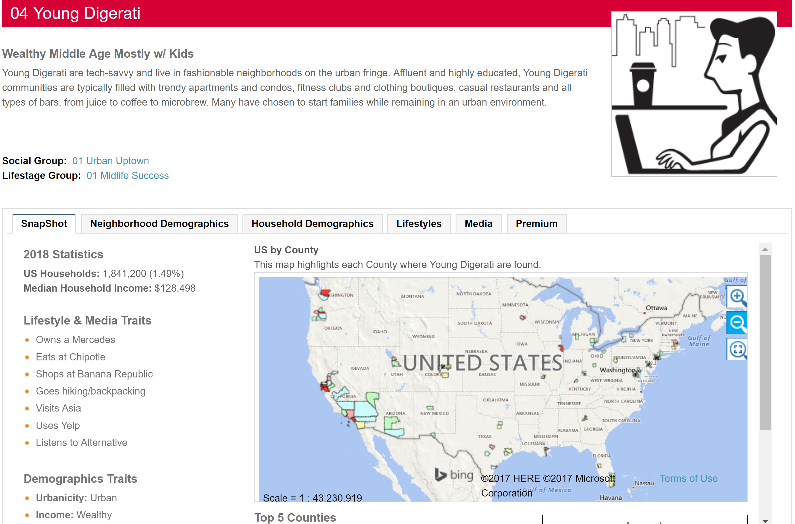
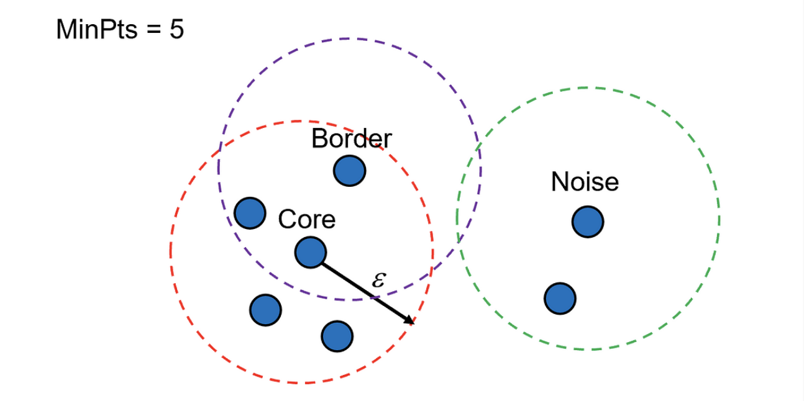

```{r,echo=FALSE,warning=FALSE,message=FALSE}
library(tidyverse)
library(broom)
```

## Today

- Segmentation with regression (supervised) 

- Example 1: Amazon online transactions

- Segmentation with cluster analysis (unsupervised)

- Example 2: Everlane retail sales

## Final Project

For the final presentation, pretend I am your client interested in a marketing problem.

It is up to you and your group to come up with the marketing problem and run the analysis.

In the final presentation (15 minutes) you will need to:
  
1) Outline the business problem

2) Describe the data

3) Talk about the model you used and why

4) Provide recommendations and **show the impact**
  
## More details
  
  In 15 minutes, that may mean only about 10 slides. Less is more!
  
  For those doing the practicum, you can use that dataset.

**Remember, I am an executive! Keep it relatively simple, succint, and actionable.**
  
  Deliverables (besides the actual presentation): a writeup no more than 5 pages and your slides.

# Segmentation with regression

## Indicators and interactions

Most people don't realize how flexible linear regression is when the variables are used correctly

Indicator (dummy) variables and interaction effects control for differences between predefined segments of the data

- Dummy variables shift the expected mean up or down by group

- Interaction terms adjust the *marginal effect* of a particular variable of interest by group

## Classic amateur analyst idea

"In my data I think the effects of price on sales will be different by country, so I'm thinking of running a separate regression for each country"

There is no need to do this, just add an indicator variable by country

## Classic amateur analyst response

"But that won't work because the slopes might be different, not just the baseline demand (i.e., the intercept)"

Then add an interaction term between price and country

## Regression equation

In general:

$$
y = \beta_0 + \beta_1x_1 + \beta_2x_2 + \ldots + \varepsilon, \varepsilon \sim N(0,\sigma^2)
$$
Data for simple example: 

```{r,echo=FALSE}
n        = 5000
beta_usa       = 120
beta_price     = -2 
beta_usaprice  = -4
set.seed(1);myData = data.frame(usa   = round(runif(n)),
                    price = runif(n,5,15))
set.seed(1);myData = myData %>%
  mutate(sales = 300 + beta_usa*usa + beta_price*price +  beta_usaprice*usa*price+rnorm(n,sd=5))
save(myData,file='data/simpleRegression.rdata')
```

```{r}
load('data/simpleRegression.rdata')
head(myData)
```

## Average sales by country

```{r}
myData %>% 
  group_by(usa) %>%
  summarise(avgSales = mean(sales))
```

## Responsiveness to price

```{r,echo=FALSE,message=FALSE}
ggplot(myData,aes(price,sales,color=factor(usa),group=factor(usa))) + 
  geom_point()+ stat_smooth(method='lm',color='black',se = FALSE) + 
  theme_bw(15) +
  scale_color_discrete(name = 'USA')
```

## Basic and lame amateur approach

```{r}
data_mex = subset(myData,usa == 0)
out_mex  = lm(sales ~ price,data_mex)
round(coef(out_mex),2)
data_usa = subset(myData,usa == 1)
out_usa  = lm(sales ~ price,data_usa)
round(coef(out_usa),2)
```

## Professional approach

$$
sales = \beta_0 + \beta_1price + \beta_2usa + \beta_3(price \times usa) + \varepsilon
$$

In this model you still allow for different intercepts and slopes by country

```{r}
out = lm(sales ~ price * usa,myData)
round(coef(out),2)
```

## How? Walk through the math

When usa = 0 and price = 5

`sales = 299.72 - 1.98*5 + 120.54*0 - 4.04*5*0 = 289.82`  

which is the same as `out_mex`:

`sales = 299.72 - 1.98*5 = 289.82`

## What about for USA observations?

When usa = 1 and price = 5

`sales = 299.72 - 1.98*5 + 120.54*1 - 4.04*5*1 = 390.16`  

which is the same as:

`sales = (299.72 + 120.54) + (-1.98 - 4.04)*5 = 390.16`  

which is the same as `out_usa`:

`sales = 420.26 - 6.02*5 = 390.16`  

## Benefits

- You appear to know what you're doing

- Less work, only one model

- More elegant solution, easier to manage

- Coefficients that *don't* need to be different by segment are more precise because they can use all observations

## How do I know when to do this?

Your exploratory analysis: plots with relationships broken into main groups might highlight interactions

Your intuition: is there reason to believe the price sensitivity varies by country?

## Get REALLY comfortable with this

- Interaction terms allow for synergies between combinations of variables

- Indicator variables shift predictions up or down

- Polynomials allow for non-linear effects (not used as often, besides simple transformations)

**These three strategies will solve 95% of your modeling needs**

## Segmentation Example: Amazon Transactions

```{r,echo=FALSE}
#demo
set.seed(1)
i = 400
id     = 1:i
region = sample(c('Southwest','Southeast','Northwest','Northeast'),i,replace = TRUE,prob = c(.4,.2,.3,.1))
hhSize = round(log(runif(i,2,50)))
hhInc  = round(rnorm(i,125000,30000))

amazon_demo = data.frame(id,region,hhSize,hhInc)

#transactions
id_t    = rep(id,times = round(runif(i,2,12)))
N = length(id_t)
date  = as.Date('2022-03-11') - sample(0:365,N,replace=TRUE)
amount = round(runif(N,6,47),2)
category = sample(c('Books','Movies','Home Goods','Electronics','Clothes','Other'),N,replace = TRUE,prob = c(.2,.04,.5,.1,.07,.09))

amazon_transaction = data.frame(id = id_t,date,amount,category)

save(amazon_demo,amazon_transaction,file='data/amazon_segmentation.rdata')
```

```{r,eval=FALSE}
load('data/amazon_segmentation.rdata')
```

Transaction and demographic information from 400 Amazon users

# Cluster Analysis

## Cluster Analysis

```{r,echo=FALSE,warning=FALSE,message=FALSE}
library(tidyverse)
library(broom)
library(ggplot2)
library(MASS)
```

In regression we talk about models of $y|x$

Clustering is all about models for $x$ alone (i.e. **un**supervised)

In clustering there are no pre-defined segments

Cluster analysis classifies a set of observations into mutually exclusive *unknown* groups based on combinations of variables

## Clustering: unsupervised dimension reduction

The purpose of cluster analysis is to organize observations (usually people) into groups, where members of a group share properties in common.

- Demographic clusters: yuppies, hipsters, etc.

- Consumption clusters: frequent loyalists, infrequent loyalists

## Example: Claritas PRIZM


## Young Digerati



## Clustering methods

There are many algorithms to choose from in cluster analysis

- Each choice may result in a different grouping structure!

Hierarchical Methods

Easier to read and interpret, but tends to be unstable

- Agglomerative: start with all objects in their own cluster, and then combine
  
- Divisive: starts with all objects in one cluster and subdivides

*I won't go over hierarchical methods, but there are some slides in the back

## Non-Hierarchical methods

Allows objects to leave one cluster and join another as the clusters form

The output is more stable across samples, sometimes hard to interpret

Computationally faster for large datasets

- K-means clustering
  
- Probabilistic (K-Means Mixture)

- DBSCAN

- Self-organized map (forces multi-dimensions into two dimensions)

## Clustering and segmentation

Market segmentation involves aggregating prospective buyers into groups that:
  
1) Have common needs

2) Will respond similarly to marketing actions

The groups that result from the market segmentation process are called market segments, a relatively homogeneous collection of prospective buyers.

## Basic market-preference patterns

Hotel clustering: amenities vs. location

```{r, warning=FALSE,echo=FALSE,fig.height=3.75, fig.width=5.75}
# scale from 1 to 100
# x = location, y = amenities
set.seed(1)
n = 50
homogenous = data.frame(x = rnorm(n,50,10),y = rnorm(n,50,10))
diffused   = data.frame(x = runif(n,0,100),y = runif(n,0,100))
clustered  = data.frame(x = c(rnorm(10,10,2),rnorm(25,60,10),rnorm(15,40,2)),
                        y = c(rnorm(10,10,1),rnorm(25,20,6),rnorm(15,80,2)))

homogenous$group = "Homogenous"
diffused$group   = "Diffused"
clustered$group  = "Clustered"

ggData = rbind(clustered,diffused,homogenous)

ggplot(ggData,aes(x,y,color=group)) + geom_point() + xlim(0,100) + ylim(0,100) +
  xlab("Location") + ylab("Comfort") + theme_minimal() +
  theme(legend.position = 'none') +
  facet_grid(.~group)
```

## Segmention is important

1) Consumers are not homogeneous

2) Opportunity for competitive advantage

3) Greater marketing effectiveness

## The clustering process

1) Select variables on which to cluster

2) Select similarity measure and scale the variables

3) Select a clustering method

4) Determine the number of clusters

5) Conduct the analysis

6) Define and name clusters

## Selecting the variables

Which variables do you want to use?
  
- Benefits sought: "How important is price to you?"

- Demographics: age, income, etc.

- Behavior: recency, frequency, monetary

- Etc: CLV, share of wallet, etc.

Depends on the *strategic reason* for segmentation

- For a new product application, probably want to cluster on benefits sought

Including irrelevant variables can strongly affect the solution

## Similarity measures

Broadly there are two types:
  
**Distance**
  
- By far the most common (our focus)

- Appropriate when variables are measured on a common metric

**Matching**
  
- Used for categorical variables

- Ratio of number of matching attributes to total number of attributes

- Most software packages don't even have this

## Measuring similarity

Data Matrix:

.    |$x_1$|$x_2$|$x_3$|$x_4$|  
-----|-----|-----|-----|-----|
$c_1$| | | | | 
$c_2$| | | | |
$c_3$| | | | |

Proximity Matrix:

.    |$c_1$|$c_2$|$c_3$|  
-----|-----|-----|-----|
$c_1$| | | |
$c_2$| $d_{21}$ | | |
$c_3$| | | |

$d_{ij}$ is the **proximity** or **distance** between customers $i$ and $j$

We collapse the four data variables into one measure

## Distance measure

The most popular distance measure is the Euclidean distance:
$$
d_{ij} = \sqrt{\sum_{p=1}^P(x_{ip}-x_{jp})^2}
$$

$P$ is the dimension of $X$

If the variables are measured in different units, one variable could overwhelm the other

Standardizing is a possible solution (subtract the mean, divide by standard deviation)

Weights can also be applied

## *Grouping individuals

Several methods for grouping customers into clusters, here are the most common ones:

- Single linkage: nearest-neighbor approach, measure based on whomever is closest

- Complete linkage: furthest-neighbor approach, criterion based on furthest distance

- Average linkage: as similar as the average similarity to all objects between clusters

- Centroid method: distance between two clusters is the distance between their centroids

- Ward's method: minimizes within-cluster variation

## Choose the clustering algorithm: K-means

Most popular clustering method

User supplies $K$, the number of clusters, and each observation is assigned to one of the $K$ clusters

Compare solutions for different values of $K$ based on interpretability, managerial usefulness, and goodness of fit

The measure of goodness of fit is based on:
$$
\frac{\text{avg. distance between all pairs of objects within a cluster}}{\text{total distance between clusters}}
$$

Within group variance **must** decrease as $K$ increases

## Basic K-Means algorithm

- Begin with initial random partitioning of all respondents into $K$ clusters

- Compute the mean (called the centroid) of each cluster

- Reassign respondents based on some criterion (e.g., assign to the cluster with the closest centroid) such that within-cluster variability reduces

- Recompute means

- Continue until no objects change cluster assignments


```{r, echo = FALSE}
set.seed(1)
centers1   = matrix(c(15, 35, 
                      75, 20, 
                      80, 160), ncol = 2, byrow = TRUE)
n_per_center = 100 
n_centers = nrow(centers1)
X1 = matrix(NA, nrow = n_per_center*n_centers, ncol = 2)
for (i in 1:n_centers) {
  rows = ((i - 1) * n_per_center + 1):(i * n_per_center)
  X1[rows, ] = matrix(rnorm(n_per_center * 2, mean = centers1[i, ], sd = 10),ncol = 2,byrow=TRUE)
}
noise = matrix(runif(75*2, 0, 120), ncol = 2)
X1 = rbind(X1, noise) 
X1[X1 <= 0] = 1

homedepot = data.frame(X1)
colnames(homedepot) = c('spend','daysBetween')
save(homedepot,file='data/homedepot.rdata')
```

## Example: The Home Depot

You work as an analyst for The Home Depot

You are trying to segment customers based on standard RFM metrics

- Recency, frequency, monetary

Interest is only in customers from the past 3 years, so ignore the recency metric

## The data

Data from 375 customers:

- Average spend per trip

- Average days between purchases

```{r}
load('data/homedepot.rdata')
str(homedepot)
```

## Simple Plot

```{r echo=FALSE}
ggplot(homedepot, aes(spend,daysBetween)) +
  geom_point() +
  theme_minimal() +
  scale_x_continuous(labels = scales::dollar) +
  xlab('Avg. Spend (M)') +
  ylab('Avg. Days Between Trips (F)')
```

## Basic K-means in R

Let's start with $k=2$
  
```{r}
#recenter the variables
hd_scaled = scale(homedepot)
kfit = kmeans(hd_scaled,centers = 2)

#total variance
kfit$tot.withinss
#sum((hd_scaled - kfit$centers[kfit$cluster,])^2)

#size of each cluster
kfit$size
```

## Selecting the number of clusters: use a scree plot

```{r}
screedf = data.frame(k = 1:10,tot.withinss = NA)
for(k in 1:nrow(screedf)){
  screedf$tot.withinss[k] = 
    kmeans(hd_scaled,centers = k)$tot.withinss
}

ggOut = ggplot(screedf,aes(k,tot.withinss)) +
  geom_line() + theme_bw(15) + geom_point() +
  scale_x_continuous(breaks = 1:10) +
  xlab("Number of Clusters") + 
  ylab("Total Within Group Sum of Squares")
```

## Scree Plot: look for the "elbow"

```{r,echo=FALSE}
ggOut
```

## Looks like 3 clusters

```{r}
kfit = kmeans(hd_scaled,centers = 3)
homedepot$cluster = kfit$cluster
```

## Visualize

```{r echo=FALSE}
ggplot(homedepot, aes(spend,daysBetween,color=factor(cluster))) +
  geom_point() +
  theme_minimal() +
  scale_x_continuous(labels = scales::dollar) +
  xlab('Avg. Spend (M)') +
  ylab('Avg. Days Between Trips (F)') + 
  scale_color_discrete(name = 'Cluster') + 
  theme(legend.position = 'bottom')
```

## Describe the clusters and label...

```{r}
homedepot %>%
  group_by(cluster) %>% 
  summarise(across(everything(),~round(mean(.),2)))
```


## The K-Means mixture

AHC and K-means have a critical limitation: each customer can only be in one cluster.

Because of this, they tend to be sensitive to outliers and don't perform well with "overlapping" clusters.

**Probabilistic clustering** overcomes these issues by incorporating uncertainty about a customer's cluster membership.

## The K-Means mixture

The population consists of a number of subpopulations ("clusters"), each having variables with a different multivariate probability density function.

This results in a *finite mixture density* for the population as a whole.

By using finite mixture densities, we now focus on estimating the parameters of the assumed mixture model and then using the estimated parameters to calculate the posterior probability of cluster membership.

In other words, what is the probability that an observation belongs to one of $K$ clusters?
  
## *Finite mixture of normals
  
For a mixture of multivariate normals, they take the form:
  
$$
  f(x;\boldsymbol p,\boldsymbol\mu,\boldsymbol\Sigma) = \sum_{k=1}^Kp_kf_k(x;\mu_k,\Sigma_k)
$$
  
- $x$ is a vector of data (the length equals the number of columns in $X$)

- $p$ is a $K$-dimensional vector of probabilities of being in each cluster (these sum to 1)

- $\mu_k$ and $\Sigma_k$ are the parameters for the associated parameters for the $k$th density

## *Simulating mixture densities

Let's start by mixing two univariate normals

```{r}
K = 2
mu    = c(4,10)
sigma = c(1,.5)
p     = c(.8,.2)

#observations to simulate
n = 1000
z = sample(1:K,n,TRUE,p)

X = rep(NA,n)
for(k in 1:K){
  X[z == k] = rnorm(sum(z==k),mu[k],sigma[k])  
}
```

## *Density plot of $X$

```{r,echo=FALSE}
plot(density(X),main="2 Component Mixture Density")
```

## *Simulating multivariate mixture densities

```{r}
K   = 2 #number of components
dim = 2 #dimension of X
parms = list()
parms[[1]] = list(mu = c(4,8),
            Sigma=matrix(c(1,.9,.9,3),ncol=dim))
parms[[2]] = list(mu = c(10,20),
            Sigma=matrix(c(.5,-.3,-.3,2),ncol=dim))
p     = c(.8,.2)

#observations to simulate
n = 1000
z = sample(1:K,n,TRUE,p)

X = matrix(NA,n,dim)
for(k in 1:K){
  X[z == k,] = mvrnorm(sum(z==k),parms[[k]]$mu,
                      parms[[k]]$Sigma)  
}
```

## *Density plot of $X_1$

```{r,echo=FALSE}
plot(density(X[,1]),main="Marginal Density of Multivariate Mixture Density")
```

## *Density plot of $X_2$

```{r,echo=FALSE}
plot(density(X[,2]),main="Marginal Density of Multivariate Mixture Density")
```

## *Joint density

```{r,echo=FALSE}
# Calculate kernel density estimate
bivn.kde = kde2d(X[,1], X[,2], n = 100) 

# Contour plot overlayed on heat map image of results
image(bivn.kde,col = terrain.colors(100),
      xlab = expression(X[1]),
      ylab = expression(X[2]))       # from base graphics package
contour(bivn.kde, add = TRUE)     # from base graphics package
```

## *Another view

```{r,echo=FALSE,warning=FALSE,message=FALSE}
library(plot3D)
X.kde = kde2d(X[,1], X[,2], n = 100)   # from MASS package
persp(X.kde$z, theta = 40, phi = 40, col = "dodgerblue", border = NA, shade = 0.2,
      xlab="X1",ylab="X2",
      zlab = "Density")
#or look at: 
# X.col  = terrain.colors(length(X.kde$z))[rank(X.kde$z)]
# persp3D(z=X.kde$z)
# http://blog.revolutionanalytics.com/2016/02/multivariate_data_with_r.html
# https://cran.r-project.org/web/packages/plot3D/vignettes/volcano.pdf
```

## Using the estimates

Observations are associated with the most likely cluster:

$$
\Pr(\text{cluster}=k|x_i) = \frac{p_kf_k(x_i;\mu_k,\Sigma_k)}{f(x_i;\boldsymbol p,\boldsymbol\mu,\boldsymbol\Sigma)},k=1 \ldots K
$$

For a particular observation $x_i$, what is the likelihood of observing that observation in the $k$th cluster?

The denominator is simply the sum of the mixture weights and densities across all of the clusters (see the formula few slides back).

## Back to The Home Depot

```{r,warning=FALSE,message=FALSE}
library("mclust")
mcfit = Mclust(hd_scaled)
```

## Mixture classification

The mixture model found 4 classes

```{r,echo=FALSE}
plot(mcfit, what = "classification")
```

## Mixture uncertainty

Notice that further away from the centers there is more uncertainty

```{r,echo=FALSE}
plot(mcfit, what = "uncertainty")
```

## Why care about uncertainty?

If there is a costly mistake on classifications (e.g., a high offer value), maybe make offer value a function of uncertainty

If a lot of observations within a cluster have a lot of uncertainty, it could just be noisy data (e.g., the newly created cluster on the last slide)

Focus A/B tests on those that are "quintessential" to the cluster to reduce variance

Depends on the context...


## DBSCAN

Groups data points based on their density, forming clusters where points are closely packed together

Unlike K-means, DBSCAN can identify clusters with irregular shapes, not just spherical ones

It effectively identifies outliers as "noise", separating them from the core clusters

DBSCAN does not require you to predefine the number of clusters; it discovers them based on data density

## In R: `dbscan`

Epsilon (`eps`):

- The size of the neighborhood around each point

- A larger value means that more points will be considered neighbors, potentially leading to larger clusters

Minimum Points (`minPts`)

- Minimum number of points to form a "core point"

- Higher values result in denser clusters

## Intuition




## In R

Using the scaled data...

```{r message=FALSE}
library(dbscan)
dbscan_out = dbscan(hd_scaled, eps = .5, minPts = 10)
homedepot$dbs1 = dbscan_out$cluster
```

## `eps = .5` and `minPts = 10`

```{r, echo=FALSE}
ggplot(homedepot, aes(spend,daysBetween,color=factor(dbs1))) +
  geom_point() +
  theme_minimal() +
  scale_x_continuous(labels = scales::dollar) +
  xlab('Avg. Spend (M)') +
  ylab('Avg. Days Between Trips (F)') + 
  scale_color_discrete(name = 'DBSCAN Cluster') + 
  theme(legend.position = 'bottom')
```

## `eps = .2` and `minPts = 10`

Very sensitive to these settings...

```{r, echo=FALSE}
dbscan_out = dbscan(hd_scaled, eps = .2, minPts = 10)
homedepot$dbs2 = dbscan_out$cluster
ggplot(homedepot, aes(spend,daysBetween,color=factor(dbs2))) +
  geom_point() +
  theme_minimal() +
  scale_x_continuous(labels = scales::dollar) +
  xlab('Avg. Spend (M)') +
  ylab('Avg. Days Between Trips (F)') + 
  scale_color_discrete(name = 'DBSCAN Cluster') + 
  theme(legend.position = 'bottom')
```

## Using cluster analysis
  
Used properly, cluster analysis can help provide structure to what appears to be hopelessly complex data.

The solution is sensitive to the choice of variables, units of measurement, distance metric, and clustering algorithm.

There is no precise or objective way to choose between alternative solutions. Managerial judgement is a critical guide. Beware of "finding what you are looking for" by trying many combinations.

## How many clusters?

Are they interpretable for a manager? Is there a label that makes sense?
  
Are they of sufficient size?
  
There are no statistical measures for k-means and agglomerative methods, but a scree plot is often a useful (and good enough) guide.

## Clustering Summary

- K-means and AHC (using Ward's method) have been found to outperform other methods in simulations.

- Partitioning methods (K-means) seeks to find the *best* K-group classification of the objects in question.

- Hierarchical methods seek to find a nested pattern or grouping of the objects - they provide a more dynamic picture of the data.

- Mixture models have a definite statistical advantage because the clustering is based on sensible models of the data, as opposed to an exploratory data summary.

- DBSCAN's strength is in dealing with arbitrary shapes of clusters and removing noise.

## Extensions of Cluster Analysis

Cluster Regression

- One use of *unsupervised* clustering is to throw the results into a *supervised* regression model.

- For example, use the cluster associated with each hotel guest to predict the probability of churning.

## Example: customer segmentation at Everlane

```{r}
load('data/everlane.rdata')
str(everlane)
```

# Extra: Hierarchical Clustering

## *Hierarchical methods 

Instead of a single solution, a hierarchy of possible solutions is formed in a tree-like structure

Thus there are $1...n$ possible clusters, where $n$ is the number of customers

The output is a tree or dendrogram, which is "pruned" at a level that appears useful

## *Hierarchical clustering process

1) Start with an $n$ cluster solution

2) Produce an $n-1$ cluster solution by combining the two most similar customers

3) Join the next two most similar items, either a previously formed cluster or individuals

4) Continue until all items are clustered (i.e., one cluster)


## *Agglomerative clustering example: US Arrests

<!-- http://uc-r.github.io/hc_clustering -->

Arrests per 100,000 residents for various crimes in 1973:

```{r,echo=FALSE}
data(USArrests)
head(USArrests)
USArrestsScaled = sapply(USArrests,scale)
distout   = dist(USArrestsScaled)
hclustout = hclust(distout,method="ward.D")
```

## *Agglomerative clustering in R

```{r}
plot(hclustout,labels = row.names(USArrests))
rect.hclust(hclustout, k=3,border = 2:5)
```

## *Interpreting a dendrogram

- Nodes are objects being clustered

- Branches indicate when the cluster method joins subgroups containing that object

- The length of the branch indicates the distances between the subgroups when they are joined

- The two most similar objects are combined first and linked at the bottom rung of the hierarchy; the next two most similar objects are combined and linked at the next rung, and so on

## *So what can we say about the cities?

```{r}
# Cut tree into 3 groups
sub_grp = cutree(hclustout, k = 3)
```

```{r,echo=FALSE,message=FALSE}
USArrests$group = sub_grp
out = USArrests %>% 
  pivot_longer(.,-5) %>% 
  group_by(group,name) %>%
  summarise(avg = mean(value)) %>% 
  pivot_wider(id_cols = name,names_from = group,values_from = avg)
out[,-1] = round(out[,-1])
out
```

## *More references

Check out the `mclust` package vignette or *An Introduction to Applied Multivariate Analysis in R* for for more applications and additional details on mixture clustering

- Parameter estimation methods (EM algorithm)

- Setting constraints on the shape of the covariance matrices

- Additional plots for model evaluation

For a really deep dive here is a whole book on the topic:
  
*Everitt, B. S., Landau, S., Leese, M., and Stahl, D. (2011), Cluster Analysis, Chichester, UK: John Wiley & Sons, 5th edition.*
